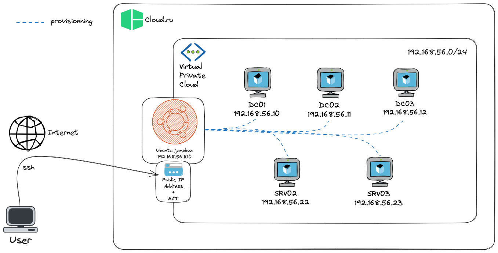

# :material-cloud: CloudRU

<div align="center">
  
  
  
</div>

The architecture is quite the same than the AWS and Azure deployment.



## Prerequisites

- [Terraform](https://www.terraform.io/downloads.html)
- `rsync`
- CloudRU temporary credentials exported in the shell that starts GOAD

## CloudRU configuration

Required environment variables:

```bash
export SBC_ACCESS_KEY="..."
export SBC_SECRET_KEY="..."
export SBC_SECURITY_TOKEN="..."
```

Optional environment variables:

```bash
export SBC_PROJECT_ID="..."
```

`SBC_PROJECT_ID` is optional because the Huawei SDK can resolve the project id from IAM for the configured region. Set it explicitly if your account has multiple matching projects or IAM project discovery fails.

## Goad configuration

- The goad configuration file as some options for CloudRU:

```
# ~/.goad/goad.ini
...
[cloudru]
cloudru_region = ru-moscow-1
cloudru_iam_endpoint = https://iam.ru-moscow-1.hc.sbercloud.ru/v3
cloudru_ecs_endpoint = https://ecs.ru-moscow-1.hc.sbercloud.ru
```

Only override the endpoints if CloudRU changes API hosts or you use a different region.

## Installation

1. Apply [CloudRU manual download patches](#manual-download-patches).

2. Install the lab:

    ```bash
    # check prerequisites
    ./goad.sh -t check -l GOAD -p cloudru
    # Install
    ./goad.sh -t install -l GOAD -p cloudru
    ```

    or from the interactive console :

    ```bash
    GOAD/cloudru/remote/192.168.56.X > install
    ```

## start/stop/status

- You can see the status of the lab with the command `status`
- You can also start and stop the lab with the command `start` and `stop`

## VMs sku

- The vm used for goad are defined in the lab terraform files : `ad/<lab>/providers/cloudru/windows.tf` and `ad/<lab>/providers/cloudru/linux.tf`
- These files are containing information about each vm in use

```
"dc01" = {
  name               = "dc01"
  domain             = "sevenkingdoms.local"
  os_image           = "Windows_Server_2019_Datacenter_64bit_06_2025_sysprep"
  private_ip_address = "{{ip_range}}.10"
  password           = "8dCT-DJjgScp"
  size               = "s7n.large.2"
}
```

## How it works ?

- On the installation goad script will create a folder into `goad/workspaces/<instance_folder>`
- This folder will contain the terraform scripts and some of the ansible inventories
- Goad will create the cloud infrastructure with terraform.
- The lab is created (not provisioned yet) and a "jumpbox" vm is also created
- Next the needed sources will be pushed to the jumpbox using `ssh` and `rsync`
- The jumpbox ssh_key is stored on `goad/workspaces/<instance_folder>/ssh_keys`
- The jumpbox is prepared to run ansible
- The provisioning is launch with ssh remotely on the jumpbox

## Install step by step

```bash
GOAD/cloudru/remote/192.168.56.X > create_empty # create empty instance
GOAD/cloudru/remote/192.168.56.X > load <instance_id>
GOAD/cloudru/remote/192.168.56.X (<instance_id>) > provide # play terraform
GOAD/cloudru/remote/192.168.56.X (<instance_id>) > sync_source_jumpbox # sync jumpbox source
GOAD/cloudru/remote/192.168.56.X (<instance_id>) > prepare_jumpbox # install dependencies on jumpbox
GOAD/cloudru/remote/192.168.56.X (<instance_id>) > provision_lab # run ansible
```

## Manual download patches

Some extensions or labs download third-party artifacts during provisioning. In CloudRU, some official vendor URLs can return `403` or expire.

Known affected components:

- ELK extension: Elastic APT packages and Winlogbeat ZIP.
- SCCM lab: Windows 10 Enterprise evaluation ISO for PXE.

Copy the patch below to a temporary file and run `git apply <file>` from the repository root.

```diff
diff --git a/ansible/roles/sccm/pxe/defaults/main.yml b/ansible/roles/sccm/pxe/defaults/main.yml
index 797bb83..bb03276 100644
--- a/ansible/roles/sccm/pxe/defaults/main.yml
+++ b/ansible/roles/sccm/pxe/defaults/main.yml
@@ -1 +1 @@
-win10_iso_url: "https://software-static.download.prss.microsoft.com/dbazure/988969d5-f34g-4e03-ac9d-1f9786c66750/19045.2006.220908-0225.22h2_release_svc_refresh_CLIENTENTERPRISEEVAL_OEMRET_x64FRE_en-us.iso"
+win10_iso_url: "https://ia801408.us.archive.org/14/items/Windows10Enterprise22H2Evaluation/19045.2006.220908-0225.22h2_release_svc_refresh_CLIENTENTERPRISEEVAL_OEMRET_x64FRE_en-us.iso"
diff --git a/extensions/elk/ansible/roles/elk/tasks/main.yml b/extensions/elk/ansible/roles/elk/tasks/main.yml
index 8c56519..b595239 100644
--- a/extensions/elk/ansible/roles/elk/tasks/main.yml
+++ b/extensions/elk/ansible/roles/elk/tasks/main.yml
@@ -18,7 +18,7 @@
 
 - name: Add Elasticsearch repository.
   apt_repository:
-    repo: 'deb https://artifacts.elastic.co/packages/{{ elasticsearch_version }}/apt stable main'
+    repo: "deb https://mirror.yandex.ru/mirrors/elastic/7 stable main"
     state: present
     update_cache: true
diff --git a/extensions/elk/ansible/roles/logs_windows/tasks/winlogbeat.yml b/extensions/elk/ansible/roles/logs_windows/tasks/winlogbeat.yml
index 64e61d1..97b0b0f 100644
--- a/extensions/elk/ansible/roles/logs_windows/tasks/winlogbeat.yml
+++ b/extensions/elk/ansible/roles/logs_windows/tasks/winlogbeat.yml
@@ -30,7 +30,7 @@
 
 - name: Download winlogbeat
   win_get_url:
-    url: "https://artifacts.elastic.co/downloads/beats/winlogbeat/winlogbeat-{{ winlogbeat_service.version }}-windows-x86_64.zip"
+    url: "https://web.archive.org/web/20250120145651id_/https://artifacts.elastic.co/downloads/beats/winlogbeat/winlogbeat-{{ winlogbeat_service.version }}-windows-x86_64.zip"
     dest: "{{ winlogbeat_service.install_path_64 }}\\winlogbeat.zip"
   when: winlogbeat_service.download and not winlogbeat_folder.stat.exists
```

Use this patch if you see errors like:

- HTTP `403` or `404` downloading Elastic packages from `artifacts.elastic.co`.
- HTTP `403` or expired link while downloading the Windows 10 Enterprise evaluation ISO for SCCM PXE.

## Tips

- To connect to the jumpbox VM you can use `ssh_jumpbox` in the goad interactive console
- To setup a socks proxy you can use `ssh_jumpbox_proxy <proxy_port>` in the goad interactive console
- `start_vm`, `stop_vm`, `restart_vm`, and `destroy_vm` accept the short VM name, full CloudRU VM name, or ECS server id
- Some labs and extensions (e.g. SCCM lab or ELK extension) can't be provisioned without manual patch because of 403 access to the websites, use [manual download patches](#manual-download-patches) to fix it
